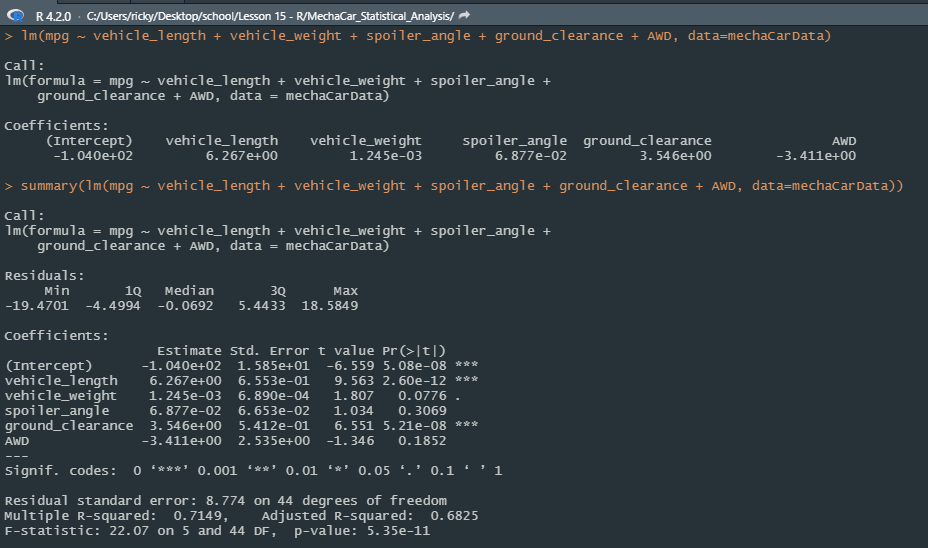
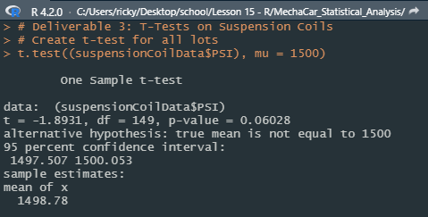
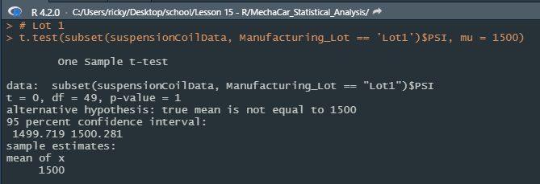
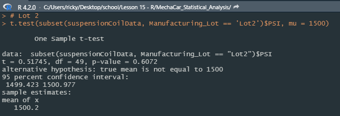
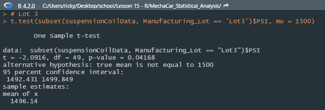

# MechaCar_Statistical_Analysis
Statistical analysis of MechaCar datasets using R

## Linear Regression to Predict MPG
A Linear Regression model that predicts the mpg of MechaCar prototypes was created. Independent variables for this model were: vehicle length, vehicle weight, spoiler angle, ground clearance and AWD capabilites.  Then an analysis on the summary of the model was preformed and a screenshot of the results are included below.

  

- Vehicle Weight, Spoiler Angle and AWD provide a non random amount of variance to the mpg values in the dataset. 
- The slope of the linear model is not considered to be zero, because the p-value of the linear model is smaller than than the significance level and this provides us with sufficient statistical evidence to reject the null hypothesis. 
- The r-squared value being 0.7149, means that the 71.5% of future datasets will fit this model, meaning this linear model does predict mpg of MechaCars effectively. 

## Summary Statistics on Suspension Coils
The next step in this analysis was to look at a supsension coil data set that contains the results from multiple production lots. The weight capacities of multiple suspension coils were tested to determine if the manufacturing process was consistent among different production lots. We created a data frame showing suspension coil's PSI across all lots combined and then another data frame from each of the lots. The design specifications for the MechaCar suspension dictate that the variance of the suspension coils must not exceed 100 pounds per square inch. Analysis of all lots combined you can see that the coils follow these specifications with a PSI variance of 62.3 but after further analysis of the individual lots it is found that suspension coils produced in manufacturing lot 3 do not follow these guidelines with a PIS variance of 170.3. Lots 1 and 2 pass the specification requirement with variances of .98 and 7.47 respectively. This high varience is due to some coils having PSI ratings far from the mean of the data. Ex: 1452, 1458 and 1542 (found in the Suspension_Coil.csv dataset). 

  

  

## T-Tests on Suspension Coils
Next, we used t-tests to determine if all manufacturing lots and each lot individually are statistically different from the hypothesized population mean of 1500 PSI.

When comparing all manufacturing lots against the against the mean PSI of the population (1500) you can see that the true mean of all of the samples is 1498.78 PSI. The p-value of .06 is higher than the .05 significance level and show that there is not significant evidence to to reject the null hypothesis. We are able to say that the mean of all three manufacturing lot's PSI is statistically similar to the presumed population mean of 1500 PSI. Results of the t-test of all lots are shown below. 

  

Results and analysis of performing the t-test on each manfuacturing lot is shown below.
From these results we can gather that:

  

- Lot 1 has a true sample mean of 1500, equal to the presumed population mean and a p-value of 1. We cannot reject the null hypothesis and there is no evidence of any statistical difference between Lot 1 PSI and the presumed PSI. 

  

- Lot 2 is similar to Lot 1 with a sample mean of 1500.2 and a p-value of .61. With this information and the fact that the p-value is larger than .05, we also have no statistical evidence to reject the null hypothesis and we can confidently say that sample mean and presumed population mean are statistically similar. 

  

- Lot 3 did not have the same result. With a sample mean of 1496.14 and the p-value is .04, which is lower than the .05 significance level. This causes us to reject the null hypothesis and indicate that the sample mean and the presumed population mean is not statistically similar and recommend that an inspection of Lot 3's suspension coils be made.

## Study Design: MechaCar vs Competition
