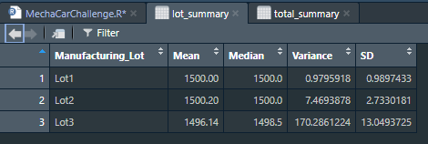

# MechaCar_Statistical_Analysis
statistical analysis of car datasets using R

## Linear Regression to Predict MPG
A Linear Regression model that predicts the mpg of MechaCar prototypes was created. Independent variables for this model were: vehicle length, vehicle weight, spoiler angle, ground clearance and AWD capabilites.  Then an analysis on the summary of the model was preformed and a screenshot of the results are included below.

- Vehicle Weight, Spoiler Angle and AWD provide a non random amount of variance to the mpg values in the dataset. 
- The slope of the linear model is not considered to be zero, because the p-value of the linear model is smaller than than the significance level and this provides us with sufficient statistical evidence to reject the null hypothesis. 
- The r-squared value being 0.7149, means that the 71.5% of future datasets will fit this model, meaning this linear model does predict mpg of MechaCars effectively. 

## Summary Statistics on Suspension Coils
The next step in this analysis was to look at a supsension coil data set that contains the results from multiple production lots. The weight capacities of multiple suspension coils were tested to determine if the manufacturing process was consistent among different production lots. We created to data frames showing suspension coil's PSI across all lots combined and then another data frame from each of the lots. The design specifications for the MechaCar suspension dictate that the variance of the suspension coils must not exceed 100 pounds per square inch. After analysis of all lots combined you can see that the coils follow these specifications with a PSI variance of 62.3 but after further analysis of the individual lots it is found that suspension coils produced in manufacturing lot 3 do not follow these guidelines with a PIS variance of 170.3. Lots 1 and 2 pass the specification requirement with variances of .98 and 7.47 respectively. This high varience is due to some coils having PSI ratings far from the mean of the data. Ex: 1452, 1458 and 1542 (found in the dataset). 

  

  

